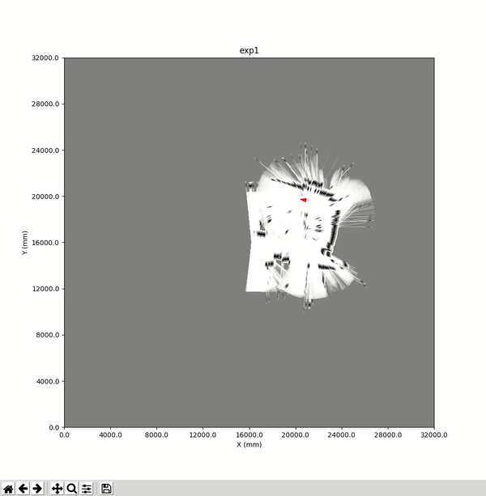

<p align="center"> 
 
<br>
<i>PyRoboViz used with <a href="https://github.com/simondlevy/BreezySLAM">BreezySLAM</a></i>
</p>

This repository contains a simple Python library for visualizing robot pose (X,Y coordinates and
rotation) and obstacles in a 2D environment.  It is suitable for use in
Simultaneous Localization And Mapping (SLAM) and related projects.  It requires
matplotlib and numpy. 

To install PyRoboViz, run the following command in a command window:

```
python3 setup.py install
```

Linux users will probably need to run this command with <tt>sudo</tt>:

```
sudo python3 setup.py install
```


